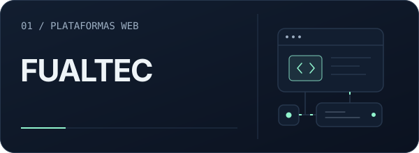
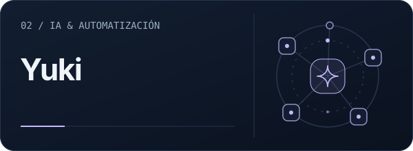
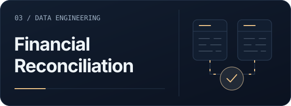
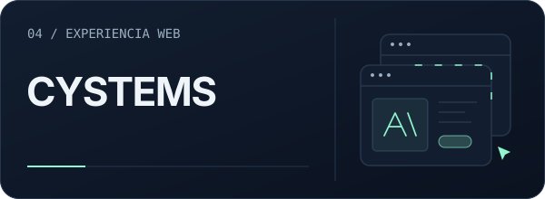
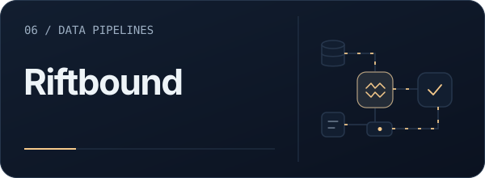
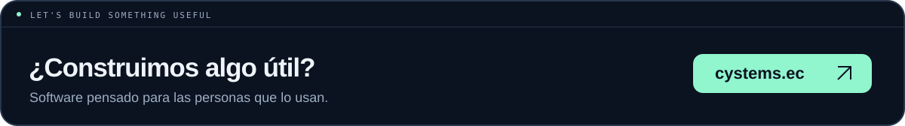

<a href="https://cystems.ec">
  <picture>
    <source media="(prefers-reduced-motion: reduce) and (max-width: 600px)" srcset="assets/hero-mobile-static.svg">
    <source media="(prefers-reduced-motion: reduce)" srcset="assets/hero-static.svg">
    <source media="(max-width: 600px)" srcset="assets/hero-mobile.svg">
    
  </picture>
</a>

  
  
  

### 01 / Software con propósito

Soy **Cristian Bravo**, desarrollador Full Stack en Ecuador y creador de **[CYSTEMS](https://cystems.ec)**. Construyo plataformas web, APIs y automatizaciones, conectando la interfaz, el backend y el despliegue en producción.

Me interesa que el software sea claro para quien lo usa y mantenible para quien lo desarrolla. Mi trabajo combina **productos web**, **procesos automatizados** y **datos que se convierten en herramientas útiles**.

  <code>Frontend &amp; UX</code> &nbsp; <code>Backend &amp; APIs</code> &nbsp; <code>Automatización &amp; datos</code> &nbsp; <code>Linux &amp; VPS</code>

### 02 / Proyectos seleccionados

Una selección de mi trabajo. Cada tarjeta lleva al código y a la documentación del proyecto.

<table>
  <tr>
    <td width="50%" valign="top">
      <a href="https://github.com/cristian-bravo/fualtec-project"><picture><source media="(prefers-reduced-motion: reduce) and (max-width: 600px)" srcset="assets/projects/fualtec-mobile-static.svg"><source media="(prefers-reduced-motion: reduce)" srcset="assets/projects/fualtec-static.svg"><source media="(max-width: 600px)" srcset="assets/projects/fualtec-mobile.svg"></picture></a>
      
<strong>Gestión documental y portal de clientes.</strong> Documentos técnicos centralizados, acceso por roles y consulta de certificados para el sector industrial.

      
<code>React</code> <code>TypeScript</code> <code>Laravel</code> <code>MySQL</code>

      
<a href="https://github.com/cristian-bravo/fualtec-project">Explorar código ↗</a> · <a href="https://fualtec.com.ec">Sitio web ↗</a>

    </td>
    <td width="50%" valign="top">
      <a href="https://github.com/cristian-bravo/yuki-demo"><picture><source media="(prefers-reduced-motion: reduce) and (max-width: 600px)" srcset="assets/projects/yuki-mobile-static.svg"><source media="(prefers-reduced-motion: reduce)" srcset="assets/projects/yuki-static.svg"><source media="(max-width: 600px)" srcset="assets/projects/yuki-mobile.svg"></picture></a>
      
<strong>Una interfaz para conectar tareas, memoria y herramientas.</strong> Demo visual pública de Yuki con datos simulados, diseñada para explorar la experiencia de una asistente de IA.

      
<code>Vue</code> <code>TypeScript</code> <code>Vite</code> <code>Anime.js</code>

      
<a href="https://github.com/cristian-bravo/yuki-demo">Explorar demo y código ↗</a>

    </td>
  </tr>
  <tr>
    <td width="50%" valign="top">
      <a href="https://github.com/cristian-bravo/automated-reconciliation-engine"><picture><source media="(prefers-reduced-motion: reduce) and (max-width: 600px)" srcset="assets/projects/reconciliation-mobile-static.svg"><source media="(prefers-reduced-motion: reduce)" srcset="assets/projects/reconciliation-static.svg"><source media="(max-width: 600px)" srcset="assets/projects/reconciliation-mobile.svg"></picture></a>
      
<strong>De movimientos bancarios a reportes útiles.</strong> Motor de conciliación que cruza datos, clasifica coincidencias y genera reportes Excel para apoyar el trabajo contable.

      
<code>Python</code> <code>pandas</code> <code>Excel</code> <code>ETL</code>

      
<a href="https://github.com/cristian-bravo/automated-reconciliation-engine">Explorar código ↗</a>

    </td>
    <td width="50%" valign="top">
      <a href="https://github.com/cristian-bravo/cristian-bravo-web"><picture><source media="(prefers-reduced-motion: reduce) and (max-width: 600px)" srcset="assets/projects/portfolio-mobile-static.svg"><source media="(prefers-reduced-motion: reduce)" srcset="assets/projects/portfolio-static.svg"><source media="(max-width: 600px)" srcset="assets/projects/portfolio-mobile.svg"></picture></a>
      
<strong>Mi espacio para mostrar lo que construyo.</strong> Portafolio con proyectos interactivos, animaciones e identidad visual, centrado en una experiencia web cuidada.

      
<code>Astro</code> <code>TypeScript</code> <code>Tailwind CSS</code> <code>Anime.js</code>

      
<a href="https://github.com/cristian-bravo/cristian-bravo-web">Explorar código ↗</a> · <a href="https://cystems.ec">Visitar portafolio ↗</a>

    </td>
  </tr>
  <tr>
    <td width="50%" valign="top">
      <a href="https://github.com/cristian-bravo/cystems-data-lab-demo"><picture><source media="(prefers-reduced-motion: reduce) and (max-width: 600px)" srcset="assets/projects/data-lab-mobile-static.svg"><source media="(prefers-reduced-motion: reduce)" srcset="assets/projects/data-lab-static.svg"><source media="(max-width: 600px)" srcset="assets/projects/data-lab-mobile.svg"></picture></a>
      
<strong>Datos para aprender haciendo.</strong> Portal educativo con una API de datos, dashboard y prácticas guiadas para conectar Power BI con información empresarial.

      
<code>Astro</code> <code>APIs REST</code> <code>Power BI</code>

      
<a href="https://github.com/cristian-bravo/cystems-data-lab-demo">Explorar proyecto ↗</a>

    </td>
    <td width="50%" valign="top">
      <a href="https://github.com/cristian-bravo/riftbound-prices"><picture><source media="(prefers-reduced-motion: reduce) and (max-width: 600px)" srcset="assets/projects/riftbound-mobile-static.svg"><source media="(prefers-reduced-motion: reduce)" srcset="assets/projects/riftbound-static.svg"><source media="(max-width: 600px)" srcset="assets/projects/riftbound-mobile.svg"></picture></a>
      
<strong>De la web a un conjunto de datos.</strong> Automatización que recopila precios de cartas desde TCGPlayer y los exporta a CSV para su análisis.

      
<code>Node.js</code> <code>Puppeteer</code> <code>CSV</code>

      
<a href="https://github.com/cristian-bravo/riftbound-prices">Explorar código ↗</a>

    </td>
  </tr>
</table>

<a href="https://github.com/cristian-bravo?tab=repositories">Ver todos mis repositorios →</a>

### 03 / Mi caja de herramientas

| Área | Tecnologías con las que trabajo |
| :--- | :--- |
| **Interfaces** | React · Next.js · Astro · Vue · TypeScript · Tailwind CSS |
| **Backend e integraciones** | Node.js · Laravel · PHP · APIs REST |
| **Datos y automatización** | Python · pandas · PostgreSQL · MySQL · MongoDB · Power BI |
| **Infraestructura** | Linux · Nginx · VPS · Cloudflare · Docker · Git |

Elijo las herramientas según el problema: una interfaz que se entienda, una API bien definida y un despliegue que se pueda mantener.

### 04 / Un poco más de mí

- **Construyo de principio a fin:** desde la experiencia de usuario hasta las integraciones y la puesta en producción.
- **Comparto lo que aprendo:** también trabajo en formación técnica, programación y herramientas digitales.
- **Sigo aprendiendo:** exploro la IA aplicada y la ciberseguridad como parte de mi desarrollo profesional.

**[Perfil profesional](https://cystems.ec/perfil/cristian-bravo)** · **[CV público en PDF](cv/Cristian_Bravo_CV_Publico.pdf)** · **[LinkedIn](https://www.linkedin.com/in/cristian-bravodev/)**

<a href="https://cystems.ec"><picture><source media="(max-width: 600px)" srcset="assets/footer-mobile.svg"></picture></a>

Hecho desde Ecuador · Cristian Bravo / CYSTEMS

