<a href="https://cystems.ec"><picture><source media="(prefers-reduced-motion: reduce) and (max-width: 600px)" srcset="assets/hero-compact-mobile-static.svg"><source media="(prefers-reduced-motion: reduce)" srcset="assets/hero-compact-static.svg"><source media="(max-width: 600px)" srcset="assets/hero-compact-mobile.svg"></picture></a>

  
  
  

Soy **Cristian Bravo**, desarrollador Full Stack en Ecuador y creador de **[CYSTEMS](https://cystems.ec)**. Construyo plataformas web, APIs y automatizaciones: de la experiencia de usuario al despliegue en producción.

### 01 / Mi actividad en GitHub

<a href="https://github.com/cristian-bravo#js-contribution-activity">
  <picture>
    <source media="(prefers-reduced-motion: reduce) and (max-width: 600px)" srcset="https://raw.githubusercontent.com/cristian-bravo/cristian-bravo/profile-metrics/assets/activity-mobile-static.svg">
    <source media="(prefers-reduced-motion: reduce)" srcset="https://raw.githubusercontent.com/cristian-bravo/cristian-bravo/profile-metrics/assets/activity-static.svg">
    <source media="(max-width: 600px)" srcset="https://raw.githubusercontent.com/cristian-bravo/cristian-bravo/profile-metrics/assets/activity-mobile.svg">
    
  </picture>
</a>

<a href="https://github.com/cristian-bravo#js-contribution-activity"><picture><source media="(max-width: 600px)" srcset="https://raw.githubusercontent.com/cristian-bravo/cristian-bravo/profile-metrics/assets/activity-recent-mobile.svg"></picture></a>

Datos de GitHub · Actualización automática cada 6 horas · <a href="https://github.com/cristian-bravo#js-contribution-activity">Ver historial completo ↗</a>

### 02 / Explora lo que construyo

<table>
  <tr>
    <td width="50%" valign="top"><a href="https://github.com/cristian-bravo/cristian-bravo-web"><picture><source media="(prefers-reduced-motion: reduce) and (max-width: 600px)" srcset="assets/projects/portfolio-mobile-static.svg"><source media="(prefers-reduced-motion: reduce)" srcset="assets/projects/portfolio-static.svg"><source media="(max-width: 600px)" srcset="assets/projects/portfolio-mobile.svg"></picture></a>
<strong>Portafolio interactivo</strong> Astro · TypeScript · Tailwind
</td>
    <td width="50%" valign="top"><a href="https://github.com/cristian-bravo/fualtec-project"><picture><source media="(prefers-reduced-motion: reduce) and (max-width: 600px)" srcset="assets/projects/fualtec-mobile-static.svg"><source media="(prefers-reduced-motion: reduce)" srcset="assets/projects/fualtec-static.svg"><source media="(max-width: 600px)" srcset="assets/projects/fualtec-mobile.svg"></picture></a>
<strong>Gestión documental y clientes</strong> React · Laravel · MySQL
</td>
  </tr>
  <tr>
    <td width="50%" valign="top"><a href="https://github.com/cristian-bravo/yuki-demo"><picture><source media="(prefers-reduced-motion: reduce) and (max-width: 600px)" srcset="assets/projects/yuki-mobile-static.svg"><source media="(prefers-reduced-motion: reduce)" srcset="assets/projects/yuki-static.svg"><source media="(max-width: 600px)" srcset="assets/projects/yuki-mobile.svg"></picture></a>
<strong>Chat, tareas y memoria simulados</strong> Vue · TypeScript · Anime.js
</td>
    <td width="50%" valign="top"><a href="https://github.com/cristian-bravo/automated-reconciliation-engine"><picture><source media="(prefers-reduced-motion: reduce) and (max-width: 600px)" srcset="assets/projects/reconciliation-mobile-static.svg"><source media="(prefers-reduced-motion: reduce)" srcset="assets/projects/reconciliation-static.svg"><source media="(max-width: 600px)" srcset="assets/projects/reconciliation-mobile.svg"></picture></a>
<strong>Conciliación y reportes Excel</strong> Python · pandas · Automatización
</td>
  </tr>
  <tr>
    <td width="50%" valign="top"><a href="https://github.com/cristian-bravo/cystems-data-lab-demo"><picture><source media="(prefers-reduced-motion: reduce) and (max-width: 600px)" srcset="assets/projects/data-lab-mobile-static.svg"><source media="(prefers-reduced-motion: reduce)" srcset="assets/projects/data-lab-static.svg"><source media="(max-width: 600px)" srcset="assets/projects/data-lab-mobile.svg"></picture></a>
<strong>Aprender con datos y APIs</strong> Astro · Power BI · APIs REST
</td>
    <td width="50%" valign="top"><a href="https://github.com/cristian-bravo/riftbound-prices"><picture><source media="(prefers-reduced-motion: reduce) and (max-width: 600px)" srcset="assets/projects/riftbound-mobile-static.svg"><source media="(prefers-reduced-motion: reduce)" srcset="assets/projects/riftbound-static.svg"><source media="(max-width: 600px)" srcset="assets/projects/riftbound-mobile.svg"></picture></a>
<strong>Precios de cartas a CSV</strong> Node.js · Puppeteer · Datos
</td>
  </tr>
</table>

<a href="https://cystems.ec/proyectos">Casos de proyecto ↗</a> · <a href="https://github.com/cristian-bravo?tab=repositories">Todos mis repositorios ↗</a>

### 03 / Tecnología y experiencia

**Interfaces** · React, Next.js, Astro, Vue, TypeScript y Tailwind CSS.  
**Backend y datos** · Node.js, Laravel, PHP, Python, PostgreSQL, MySQL y MongoDB.  
**Infraestructura** · Linux, Nginx, VPS, Cloudflare, Docker y Git.

Trabajo en plataformas educativas, sistemas empresariales, automatización e integración de IA. También comparto conocimientos como docente técnico y curso una **maestría en Ciberseguridad**.

**[Mi hoja de vida completa](cv/Cristian_Bravo_Full_Stack_Developer_CV.pdf)** · **[Perfil profesional](https://cystems.ec/perfil/cristian-bravo)** · **[LinkedIn](https://www.linkedin.com/in/cristian-bravodev/)**

<a href="https://cystems.ec"><picture><source media="(max-width: 600px)" srcset="assets/footer-mobile.svg"></picture></a>

Hecho desde Ecuador · Cristian Bravo / CYSTEMS

